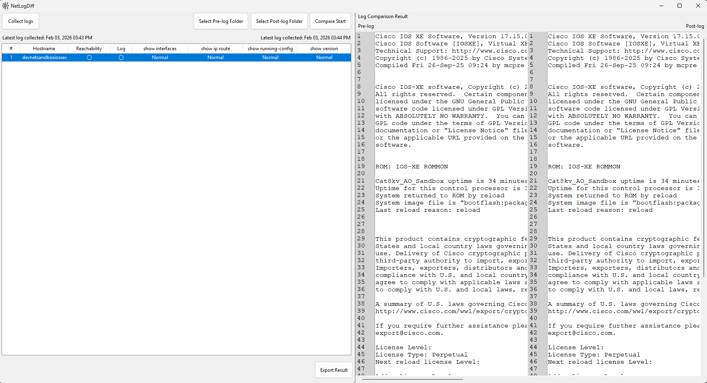

# 🧾 NetLogDiff

NetLogDiff is a Windows desktop application designed to help network engineers perform rapid post-configuration analysis of network devices. By collecting and comparing logs using standard show commands, it enables engineers to validate the success of configuration changes, identify discrepancies, and ensure network stability.

With built-in device reachability checks, visual and textual log comparison tools, and exportable reports, NetLogDiff simplifies the often time-consuming task of confirming whether work has been completed correctly and without unintended impact.

The application uses a **`Config.csv` file** to define all devices, credentials, and specifications for log collection and comparison. Devices listed in this file are automatically displayed in the UI for batch operations and analysis.



---

## 📚 Table of Contents

- [✨ Features](#-features)
- [✅ Supported show commands](#-supported-show-commands)
- [📄 File Naming Convention](#-file-naming-convention)
- [🚀 Usage](#-usage)
- [🛠 Installation](#-installation)
- [🏗️ Build with PyInstaller](#️-build-with-pyinstaller)

---

## ✨ Features

- Collect logs from **multiple network devices** using CLI-based `show` commands defined in `Config.csv`.
- Define all device specifications and credentials in a centralized, configurable CSV file.
- Compare two log files side-by-side — supports output from **any network `show` command**.
- Highlight and visualize line-by-line differences for fast change verification.
- Export comparison results to a log-friendly file format.
- Cross-platform support: **Windows** and **Linux**.
- User-friendly **GUI** built with **Tkinter**.
- Designed for **Python 3.10+**.

---

## ✅ Supported Show Commands

NetLogDiff supports **any type of `show` command output** collected from network devices. It can retrieve logs from **multiple devices** and perform comparisons between any set of captured logs.

Examples include (but are not limited to):

- `show running-config`
- `show version`
- `show interfaces`
- `show logging`
- `show ip route`

> 🛠️ You can use **any CLI `show` command**. The only requirement is that each output be saved as a `.log` file with the correct [filename format](#-file-naming-convention).

---

## 📄 File Naming Convention

To be recognized and compared by the tool, **input log files must strictly follow** this naming format:

`[hostname]_[timestamp].log`

---

### ✅ Format Breakdown

| Component     | Description                                                             | Example            |
|---------------|-------------------------------------------------------------------------|--------------------|
| `hostname`    | The device's hostname (no spaces or special characters)                 | `router1`, `core01`|
| `timestamp`   | Recommended format: `YYYYMMDD_HHMMSS`                                   | `20250529_103045`  |
| `.log`        | File extension (must be `.log`)                                         | `.log`             |

---

### ✅ Valid Filename Examples

- `router1_20250529_103045.log`
- `switch5_20250529_091522.log`
- `core01_20240515_230000.log`

### ❌ Invalid Filename Examples

| Filename Example                             | Reason                                                  |
|----------------------------------------------|---------------------------------------------------------|
| `show-ip-route_router1_20250529.log`         | Incorrect order (hostname must come first)              |
| `router1-show-ip-route-20250529.txt`         | Invalid file extension (`.txt`)                         |
| `Router 1_show-ip-route_20250529.log`        | Hostname contains a space                               |
| `router@core_show-ip-route_20250529.log`     | Hostname contains invalid character (`@`)               |
| `router1_show ip route_20250529.log`         | Show command contains spaces                            |
| `router1_show_interface/status_20250529.log` | Invalid character (`/`) in filename                     |
| `router1_show-ip-route_29-05-2025.log`       | Non-standard timestamp format                           |

> ⚠️ **Note:** Files that do not match the expected format will be **skipped or rejected** by the application.

---

## 📁 Config.csv Format

All devices, credentials, and configuration settings for log collection and comparison must be defined in a `Config.csv` file.

📘 Column Descriptions:
| Column	            | Description                                                            |
|-----------------------|------------------------------------------------------------------------|
| `hostname`	        | Logical name of the device (used in filenames and UI display)          |
| `ipaddress`	        | IP address or hostname for Telnet/SSH connection                       |
| `username`	        | Login username                                                         |
| `password`	        | Login password                                                         |
| `admin_password`	    | Enable/privileged mode password (if applicable)                        |
| `device_os`	        | OS/platform (e.g., cisco_ios, juniper_junos, etc.)                     |
| `connection_type`	    | ssh or telnet                                                          |
| `skip`	            | If set to True, the device is skipped during automated log collection  |
| `show_commands`	    |  A filename (e.g. cisco_ios.txt) that contains a list of show commands |

> ✅ Devices listed here will appear in the UI and be used for collection and comparison.

---
## 📝 Show Commands File Example (cisco_ios.txt)

Each device references a .txt file containing the list of show commands to be executed. For example:

File: cisco_ios.txt

```bash
show running-config
show version
show ip interface brief

```
This modular approach lets you reuse command sets across devices and customize easily per platform or role.

> ✅ Devices listed in Config.csv will appear in the UI device table for log collection and diff operations.

---

## 🚀 Usage

You can run the application either from the Python source or as a standalone Windows executable.

---

### 🟩 Option 1: Run from Source

```bash
python main.py
```

### 🟦 Option 2: Run the .exe (Windows)
If you built the application using PyInstaller (see below), you'll find a folder called dist/ that contains your executable.

Steps:
1. Navigate to the dist/ directory:

```bash
cd dist
```

2. Run the application:

```bash
./NetLogDiff.exe
```
Or simply double-click NetLogDiff.exe from File Explorer.


> ⚠️ **Note:** The .exe is self-contained and doesn't require Python or external libraries to be installed on the user's system.

The GUI will open, allowing you to:

- Select and compare two log files
- View highlighted differences
- Export results to a log file format for record-keeping

---

## 🛠 Installation
### 1. Clone the Repository
```bash
git clone https://code.mahitahi.global.fujitsu.com/fnets/ui-tool
cd ui-tool-main
```

## 2. Install Dependencies

Install required Python libraries:

``` bash
pip install -r requirements.txt
```

## 3. Prerequisites

- Python 3.10+
- Tkinter (included in standard Python distributions)
- OS: Windows or Linux

## 🏗️ Build with PyInstaller

To create a standalone executable:

``` bash
pyinstaller main.spec
```